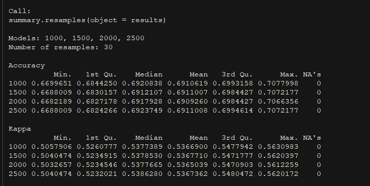

In this file we have applied four different models (SVM Radial, Multinomial Regression, XGBoost, and Random Forest) to our dataset to predict animal outcomes for the Austin Animal Center. Below we do additional model related cleanup, apply our models to the dataset, and then detail our conclusions and future recommendations and enhancements we gleaned from doing this project.

**Note** that we included certain tags like echo=FALSE and eval=FALSE after we had already trained our models and saved them off to a file. We did this to speed up the file knitting process.

```{r message=F, warning=F}
libraries <- c("tidyverse", "ggplot2", "randomForest", "caret",
               "lubridate", "nnet", "mlr", "FSelector", "xgboost",
               "Ckmeans.1d.dp")

for(lb in libraries){
  # cat(paste(lb))
  if(!(require(lb, character.only = TRUE))){
    install.packages(lb, repos = "http://cran.us.r-project.org")
  }

  library(lb, character.only = TRUE)
}
```

```{r}
cad_model <- read.csv("Data/Cleaned_Data_Frame.csv") %>%
             select(-X)
```

Prep the data for modeling
```{r}
cad_model <- cad_model %>%
       select(-DateTime, -MonthYear, -Found.Location, -Breed, -breed_new, -Color)
cad_model <- createDummyFeatures(cad_model,
                                 target = "OutcomeType",
                                 cols = c("S_Organ_Status_In", "Sex", "S_Organ_Status_Out", "AnimalType",
                                          "Intake.Type", "Intake.Condition", "breed_group"))
```
#Handle Dummified Columns
After having dummified the columns, we rename and remove certain columns that would be duplicative or are confusingly named.
```{r}
cad_model <- cad_model %>%
       select(-AnimalType.Cat) %>%
       dplyr::rename(Is_Dog = AnimalType.Dog)
```

We will be modeling on OutcomeType variable
```{r data_split}
# Set the number of classes in our classification model
countClasses <- length(unique(cad_model$OutcomeType))
# Train and test split
seed <- 333
inTraining <- createDataPartition(cad_model$OutcomeType, p=0.6, list=FALSE)
training.set <- cad_model[inTraining,]
trainAnimalID <- training.set$AnimalID
training.set <- training.set %>%
  select(-AnimalID)
Totalvalidation.set <- cad_model[-inTraining,]

# This will create another partition of the 40% of the data, so 20%-testing and 20%-validation

inValidation <- createDataPartition(Totalvalidation.set$OutcomeType, p=0.5, list=FALSE)
testing.set <- Totalvalidation.set[inValidation,]
testAnimalID <- testing.set$AnimalID
testing.set <- testing.set %>%
  select(-AnimalID)
validation.set <- Totalvalidation.set[-inValidation,]
validAnimalID <- validation.set$AnimalID
validation.set <- validation.set %>%
  select(-AnimalID)
```

#XGBoost
We decided to apply the XGBoost model to our data for two main reasons, those are:

* Since XGBoost leverages parallelization, which uses all of our CPU cores during training, this leads to great execution speed. It was running in a quarter to half the time of our Random Forest or SVM Radial mdoels.

* Model performance, XGBoost does a very good job on structured and tabular datasets for classification and regression predictions. Since we cleaned and structured our data in advance, it helps us take full advantage of the XGBoost model.
```{r xgboost-setup}

# Convert classes to integers for xgboost
outcomes <- bind_cols(OutcomeType=c("Adoption", "Died", "Euthanasia",
                                        "Return_to_owner", "Transfer"),
                          Outcome=c(0,1,2,3,4))
# XGBoost requires the classification classes to be encoded as numeric
trainNumeric <- merge(training.set, outcomes, by="OutcomeType", all.x=TRUE, sort=F) %>%
  select(-OutcomeType)
testNumeric <- merge(testing.set, outcomes, by="OutcomeType", all.x=TRUE, sort=F) %>%
  select(-OutcomeType)
trainY <- trainNumeric$Outcome
testY <- testNumeric$Outcome
trainNumeric <- trainNumeric %>%
  select(-Outcome)
testNumeric <- testNumeric %>%
  select(-Outcome)
```

## Now to create the xgboost model

```{r xgboost-mlr-learner}
# xgboost-specific design matrices
xgb_train <- xgb.DMatrix(data = as.matrix(trainNumeric),
                         label=as.matrix(trainY), missing=NA)
xgb_test <- xgb.DMatrix(data = as.matrix(testNumeric),
                         label=as.matrix(testY), missing=NA)

params <- list(objective = "multi:softprob", num_class = countClasses, eval_metric = "mlogloss")
```

Calculate # of folds for cross-validation (saved to rds file as it takes some time)
```{r}
# xgbcv <- xgb.cv(params = params, data = xgb_train, nrounds = 200, nfold = 5, showsd = TRUE,
#                 stratified = TRUE, early_stop_round = 30,
#                 maximize = FALSE, prediction = TRUE)
# save(xgbcv, file="xgb_cv.rda")
load(file="xgb_cv.rda")
# Assign class based on max prob
xgb_train_preds <- data.frame(xgbcv$pred) %>%
  mutate(max = max.col(., ties.method = "last"), label = trainY + 1)
outcomes <- outcomes %>%
  mutate(outcome_nonz = Outcome +1)
xgb_train_preds <- left_join(xgb_train_preds, outcomes, by=c("max" = "outcome_nonz")) %>%
  rename(predOutcome = OutcomeType) %>%
  select(-Outcome)
xgb_train_preds <- left_join(xgb_train_preds, outcomes, by=c("label" = "outcome_nonz")) %>%
  rename(actOutcome = OutcomeType) %>%
  select(-Outcome)
# Generate confusion matrix
confusionMatrix(factor(xgb_train_preds$actOutcome),
                                  factor(xgb_train_preds$predOutcome),
                                  mode = "everything")
```
Looks like there is a fairly high error rate of 32.7% unfortunately.

Evaluate number of rounds for xgboost.
```{r xgb-nrounds}
min_logloss <- min(xgbcv$evaluation_log[, test_mlogloss_mean])
min_logloss_index = which.min(xgbcv$evaluation_log[, test_mlogloss_mean])
print(min_logloss_index)
```
The nrounds for our model should be 29
```{r xgb-model}
xgb_model <- xgb.train(params = params, data = xgb_train, nrounds = 29)

# Predict for test set
xgb_test_preds <- predict(xgb_model, newdata = xgb_test)

xgb_test_out <- matrix(xgb_test_preds, nrow = 5, ncol = length(xgb_test_preds) / 5) %>%
               t() %>%
               data.frame() %>%
               mutate(max = max.col(., ties.method = "last"), label = testY + 1)
xgb_test_out <- left_join(xgb_test_out, outcomes, by=c("max" = "outcome_nonz")) %>%
  rename(predOutcome = OutcomeType) %>%
  select(-Outcome)
xgb_test_out <- left_join(xgb_test_out, outcomes, by=c("label" = "outcome_nonz")) %>%
  rename(actOutcome = OutcomeType) %>%
  select(-Outcome)
# Confustion Matrix
xgb_conf <- confusionMatrix(factor(xgb_test_out$actOutcome),
                                  factor(xgb_test_out$predOutcome),
                                  mode = "everything")
xgb_conf
```
Looks like overal accuracy hovers at 69.3%. We will note that the other Kaggle teams
achieved at maximum 79% accuracy without including the outcome date variable, which
qualifies as data leakage.

We can visualize our confusion matrix below
```{r}
qplot(actOutcome, predOutcome, data=xgb_test_out,  colour= actOutcome,
      geom = c("boxplot", "jitter"),
      main = "XGBoost: predicted vs. observed in test data",
      xlab = "Observed Outcome",
      ylab = "Predicted Outcome")
```

If we pay attention to the "/" diagonal, we see which classes were easier to correctly predict.
The good news is that adoption seems most Euthanasia has the highest accuracy of class at 84.5%,
according to the confusion matrix, which is the most critical category for prediction.
We also see that adoptions are not confused for other classes too often, unless it is Return_to_owner.
Return to Owner and Adoption seem to get cross-classified often, which for the shelter's purposes is
not a bad error to make. The only concerning category is Transfer. The misclassification as adoption
would not be helpful to the shelter.

### Feature Importance
We can also get feature importance from xgboost
```{r model-feat-imp}
# compute feature importance matrix
xgb_imp = xgb.importance(feature_names = setdiff(names(trainNumeric),"OutcomeType"), model = xgb_model)
xgb.ggplot.importance(xgb_imp)
```

#Multivariate Logistic Model
We decided to use multinomial logistic regression for our data to change things up a bit as well as because of one interesting feature it has:

* Like other forms of regression, there is no need for the independent variables to be statistically independent from each other. Since some of the variables in our dataset might be slightly related to another variable, we thought it was worth trying our this model.

```{r}
multinomModel <- multinom(OutcomeType ~ ., data = training.set)
confusionMatrix(as.factor(training.set$OutcomeType),
                as.factor(predict(multinomModel, training.set)), mode = "everything")
```
It looks like the error rate on the multinomial model is also relatively high at 32.2%. However, it looks like the model fails to predict to find any pets that end of dying.

Confusion matrix on test set results
```{r multinomial-confusion}
multiPredProb <- predict(multinomModel, testing.set, type = "prob")
multiPred <- predict(multinomModel, testing.set)
multiNomOut_conf <- confusionMatrix(testing.set$OutcomeType, multiPred, mode = "everything")
multiNomOut_conf
```

The accuracy on this model is also around 68.5%. The "Died" class is not being predicted at all.
```{r}
qplot(testing.set$OutcomeType, multiPred, colour=testing.set$OutcomeType,
      geom = c("boxplot", "jitter"),
      main = "Multinomial Model: predicted vs. observed in test data",
      xlab = "Observed Outcome",
      ylab = "Predicted Outcome")
```

We see that the "Died" class is missing from the predicted outcome y axis in the matrix.
It looks like many of the actual "Died" class were classified as "Transfer".

#SVM Radial Model
Next, we'll explore a Support Vector Machine (SVM) machine learning model. This is a common algorithm for classification problems.

```{r svm, eval=FALSE}
svm_Radial <- caret::train(OutcomeType ~.,
                    data = training.set,
                    method = "svmRadial",
                    preProcess = c("center", "scale"),
                    tuneLength = 10)

svmModel <- predict(svm_Radial, newdata=testing.set)
svmConfusion <- confusionMatrix(data=svmModel, testing.set$OutcomeType)
save(svm_Radial, svmModel, svmConfusion, file = "svmModel.rda")
```

```{r svm-load}
load(file = "svmModel.rda")
svmConfusion
```
Here we can see that we're getting an accuracy of 69 percent. This is still better than chance, but we'll see if we can achieve higher accuracy.
```{r svm-qplot}
qplot(testing.set$OutcomeType, svmModel,  colour= testing.set$OutcomeTyp,
      geom = c("boxplot", "jitter"),
      main = "SVM: predicted vs. observed in test data",
      xlab = "Observed Outcome",
      ylab = "Predicted Outcome")
```

#Random Forest Model
The reason we chose Random Forest as one of our models is due to a couple of the important features that are a part of the Random Forest model. The ones we were interested were:

* It's ability to easily handle large number of input variables without variable deletion.

* It runs efficiently on large datasets (ours is not super massive, but it is bigger than what we dealt with in class).

* It generates an internal unbiased estimate of the generalization error as the forest building progresses.

We initially trained our Random Forest model with default or auto-tune parameters.
```{r include=F}
new_names <- names(training.set)
prev_names <- c("Name", "OutcomeType","AgeuponOutcome", "AgeuponIntake", "mix",
                         "breed_common", "S_Organ_Status_In_Intact", "S_Organ_Status_In_Neutered",
                         "S_Organ_Status_In_Spayed", "S_Organ_Status_In_Unknown", "Sex_Female",
                         "Sex_Male", "Sex_Unknown", "S_Organ_Status_Out_Intact", "S_Organ_Status_Out_Neutered",
                         "S_Organ_Status_Out_Spayed", "S_Organ_Status_Out_Unknown", "Is_Dog",
                         "Intake.Type_Euthanasia.Request", "Intake.Type_Owner.Surrender", "Intake.Type_Public.Assist",
                         "Intake.Type_Stray", "Intake.Condition_Aged", "Intake.Condition_Feral",
                         "Intake.Condition_Injured", "Intake.Condition_Normal", "Intake.Condition_Nursing",
                         "Intake.Condition_Other", "Intake.Condition_Pregnant", "Intake.Condition_Sick",
                         "breed_group_Domestic.Short.Hair", "breed_group_Herding", "breed_group_Hound",
                         "breed_group_Non.Sporting", "breed_group_Other.Cat", "breed_group_Pit.Bull",
                         "breed_group_Sporting", "breed_group_Terrier", "breed_group_Toy",
                         "breed_group_Unknown", "breed_group_Working")
names(training.set) <- prev_names
names(testing.set) <- prev_names
```

```{r rf-fit, eval=F}
rf_fit <- train(OutcomeType ~ .,
                data = training.set,
                method = "rf",
                metric = "Accuracy",
                preProcess = c("center", "scale"),
                tuneLength = 10)
save(rf_fit, file="rf_initial_fit.rda")
```

```{r}
load(file="rf_initial_fit.rda")
rf_pred <- predict(rf_fit, newdata=testing.set)

confusionMatrix(data=rf_pred, testing.set$OutcomeType)
```

Use bestmtry to find best mtry values for our Random Forest model.
```{r rf-mtry, eval=FALSE}
#Find the best mtry value to use in my model
x <- training.set %>%
    select(-OutcomeType)
y <- training.set %>%
    select(OutcomeType) %>%
    .$OutcomeType
# Algorithm Tune (tuneRF)
set.seed(seed)
bestmtry <- tuneRF(x, y, stepFactor=1.5, improve=1e-5, ntree=500)
print(bestmtry)
```
```{r}

```

Based on the output of bestmtry it looks like the best mtry value to use would be 4.

Find optimized number of trees to use in Random Forest model.
```{r rf-ntree, eval=FALSE}
metric <- "Accuracy"

#Find the correct number of trees (ntree) to use in my model
control <- trainControl(method="repeatedcv", number=10, repeats=3, search="grid")
tunegrid <- expand.grid(.mtry=c(sqrt(ncol(training.set))))
modellist <- list()
for (ntree in c(1000, 1500, 2000, 2500)) {
	set.seed(seed)
	fit <- train(OutcomeType ~ ., data=training.set, method="rf", metric=metric, tuneGrid=tunegrid, trControl=control, ntree=ntree)
	key <- toString(ntree)
	modellist[[key]] <- fit
}
# compare results
results <- resamples(modellist)
summary(results)
dotplot(results)
```

Optimal number of trees to use in our model is 1500.

Find what the most important predictor variables are related to our outcome variable. This leverages the importance and varImpPlot methods from randomForest library.
```{r fig.width=10, fig.height=10}
#Find best predictor variables
# rf_pv <- randomForest(OutcomeType ~ ., data=training.set, ntree=1000, keep.forest=FALSE, importance=TRUE)
# save(rf_pv, file="rf_pv.rda")
load(file="rf_pv.rda")
importance(rf_pv) # relative importance of predictors (highest <-> most important)
varImpPlot(rf_pv) # plot results
```


Now that we have found the optimized parameters, we will run a more targeted RF model
```{r rf-final, eval=FALSE}
seed <- 333

tunegrid <- expand.grid(.mtry=c(sqrt(ncol(training.set))))
control <- trainControl(method="repeatedcv", number=10, repeats=3, search="grid")
#tunegrid <- expand.grid(.mtry=4)
metric <- "Accuracy"


final_fit_rf <- train(OutcomeType ~ .,
                   data=training.set,
                   method="rf", metric=metric,
                   tuneGrid=tunegrid,
                   trControl=control,
                   ntree=1500)

save(final_fit_rf, file="rf_final_fit.rda")
```

```{r rf-model-load, fig.height=10, fig.width=10}
load(file="rf_final_fit.rda")
final_pred_rf <- predict(final_fit_rf, newdata=testing.set)
rfConfusion <- confusionMatrix(data=final_pred_rf, testing.set$OutcomeType)
```

```{r rf-qplot}
qplot(testing.set$OutcomeType, final_pred_rf,  colour= testing.set$OutcomeTyp,
      geom = c("boxplot", "jitter"),
      main = "Random Forest: predicted vs. observed in test data",
      xlab = "Observed Outcome",
      ylab = "Predicted Outcome")
```

# Model Evaluation
We have been continually evaluating models for each of the 4 models, but here we will compare on metrics that we care most about.
For the animal shelter, we determined that the following metrics are more important:

 * Higher Sensitivity for Died and Euthanasia
    * (we care most about correctly identifying pets that WERE euthanized or died)
 * Higher Specificity for Adopted, Return_to_Owner
    * (We care most about correctly identifying pets that were NOT adopted or returned)
 * Higher Balanced Accuracy for Transfer
    * (We care most about correctly idnetifying pets when they are transferred overall)

```{r model-eval}
eval_matrix <- outcomes[,"OutcomeType"]
eval_matrix[,c("XGBoost", "Multinomial", "SVM", "RandomForest")] <- NA

for (class in eval_matrix$OutcomeType) {
  if (class %in% c("Adoption", "Return_to_owner")) {
    evalMetric <- "Sensitivity"
  } else if (class %in% c("Adoption", "Return_to_owner")) {
    evalMetric <- "Specificity"
  } else if (class == "Transfer") {
    evalMetric <- "Balanced Accuracy"
  }
  eval_matrix[eval_matrix$OutcomeType==class,"XGBoost"] <- xgb_conf$byClass[paste0("Class: ", class), evalMetric]
  eval_matrix[eval_matrix$OutcomeType==class,"Multinomial"] <- multiNomOut_conf$byClass[paste0("Class: ", class), evalMetric]
  eval_matrix[eval_matrix$OutcomeType==class,"SVM"] <- svmConfusion$byClass[paste0("Class: ", class), evalMetric]
  eval_matrix[eval_matrix$OutcomeType==class,"RandomForest"] <- svmConfusion$byClass[paste0("Class: ", class), evalMetric]
}

eval_matrix[is.na(eval_matrix)] <- 0
eval_matrix <- eval_matrix %>%
  mutate(bestModel = max.col(eval_matrix[,-1], ties.method = "last")) %>%
  mutate(bestModel = ifelse(bestModel == 4, "RandomForest",
                      ifelse(bestModel == 1, "XGBoost",
                             ifelse(bestModel == 2, "Multinomial",
                                    ifelse(bestModel == 3, "SVM", "")))))
print(eval_matrix)
```

We can see that according to our evaluation metrics: 

 * Random Forest is the best model to predict positive outcomes (Adoption and Return to Owner)
    * Again, this measure is showing which model best predicts a Negative for these outcomes
    * That is, these tell the shelter when an animal is not adopted or returned to owner
    * RandomFOrest has a very high Non-Adoption prediction rate of 84%
 * XGBoost is the best model to predict negative outcomes (Died, Euthanasia and Transfer)
    * For Euthanasia and Death these are true negative outcomes
    * For Transfer we are looking at overall accuracy


##Enhancements and Recommendations for Further Optimizing Animal Shelters Data Models

Having completed our EDA and data modeling for the Austin Animal Shelter Kaggle competition, we discussed a group what could be done in order to better assist the Austin Animal Center and our models to be able to make more accurate outcome predictions. We came up with a couple of recommendations for the animal center, as well as some enhancements we could do currently if we had more time, to be able to produce more accurate and useful results to help these animals recieve better outcomes.

Enhancements to the process we did:

* Look to leverage the color variable that was supplied in the Kaggle dataset. We had to ignore this variable due to the
fact that this variable contained thousands of minor variations and combinations in fur color that we did not have time to try and categorize or group. With more time, we would come up with an accurately and detailed categorization system that would allows us to group animals together based on fur color and combinations in order to allows us to dummify and leverage this column in our models. Since most models can't train if a variable has more than 53 categories (and we didn't want our dummify to produce thousands of distinct columns for all the color combinations), we would want to create a more targetted color categorization system.

* Split up our data set into two new datasets, one for cats and one for dogs, and look to train individual models for each animal type. This would help to remove some of the confusion in our models that having the two types of animals and all their breed and color combinations in the same dataset produced.

Recommendations:

* If we were to split our dataset up into datasets for cats and dogs, we would then love to work with the Austin Animal Center to collect and utilize additional information that unique to those type of animals. For example, for cats it would be very useful to know if the cat is de-clawed or not, since this is often a major factor in people being willing or able to adopt a cat, since clawed cats can damage furniture or carpets.

* Working with the Austin Animal Center to collect additional general information about their shelter animals. We feel that information like animal intake weight, geo-coded locations for where the animal was found, or if the animal had prior surgeries would be very helpful in being able to better predict animal outcomes with our ML models.
